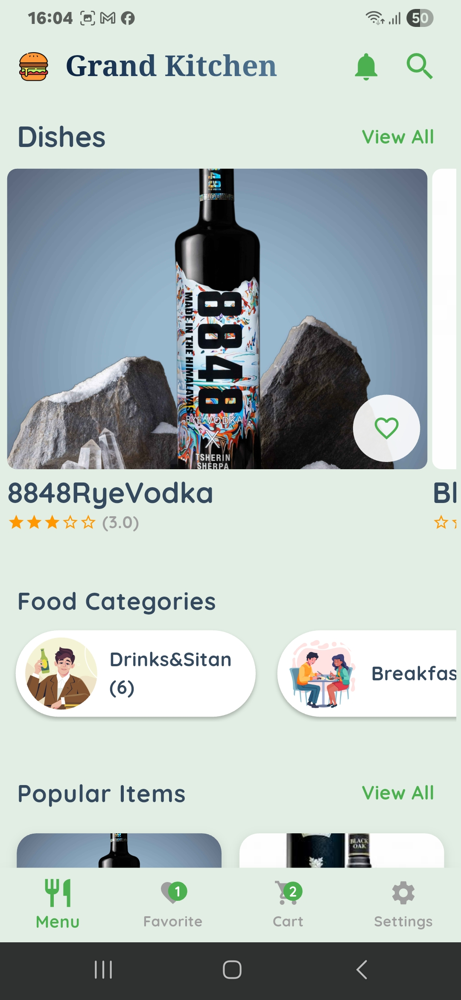
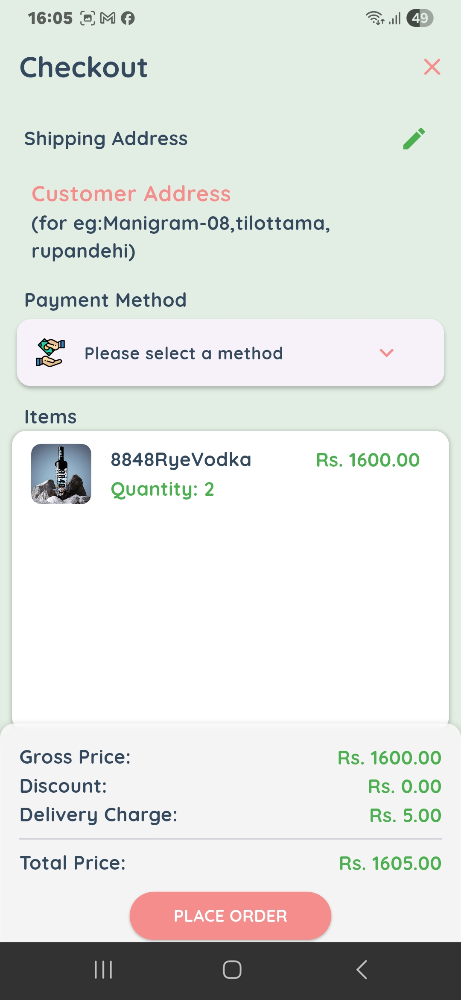

# 🍽️ Restaurant App Suite

A full-featured restaurant management and ordering system built using **Flutter**, designed to optimize daily restaurant operations and provide seamless ordering experiences for customers.

---

## 🧩 Project Structure

This repository contains two Flutter apps:

| App Name     | Description |
|--------------|-------------|
| [`client_app`](./client_app) | 📱 A mobile app for customers to browse menus, place orders, and track delivery. |
| [`admin_app`](./admin_app) | 🛠️ An admin dashboard for restaurant managers to manage menus, orders, and customers. |

---

## ✨ Highlights

- 🔄 Real-time order tracking and status updates
- 🔔 Push notifications using Firebase
- 📦 Menu item management with availability toggling
- 📍 Customer location tracking and map integration
- 📊 Data visualization for performance insights
- 🧭 Smooth and intuitive Flutter UI
- 💾 Persistent storage with Supabase backend

---

## 📸 Screenshots

| Client App | Admin App |
|------------|-----------|
|  |  |
|  |  |

> 📂 More screenshots are available in their respective folders.

---

## 🛠️ Tech Stack

- **Flutter** (Client & Admin UIs)
- **Supabase** (Database + Auth)
- **Firebase Cloud Messaging** (Notifications)
- **Google Maps API** (Location Services)

---

## 🚀 Getting Started

To run either app locally:

1. Clone the repo:
```bash
git clone https://github.com/yourusername/Restaurant_App.git
