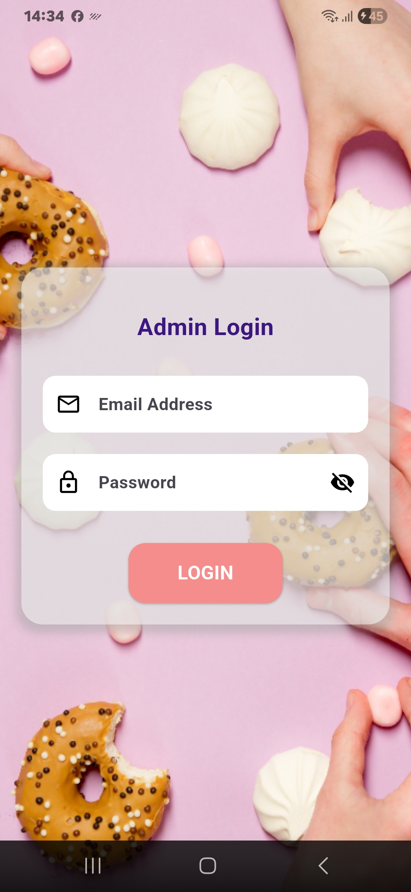
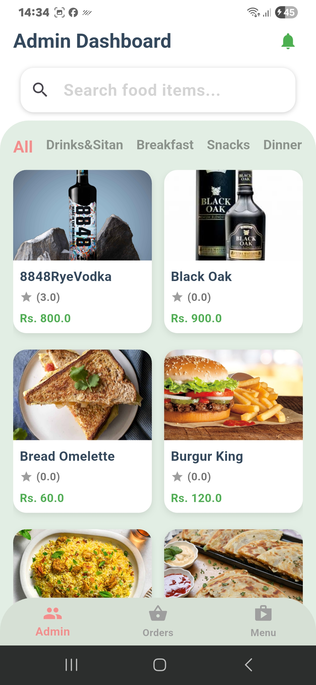
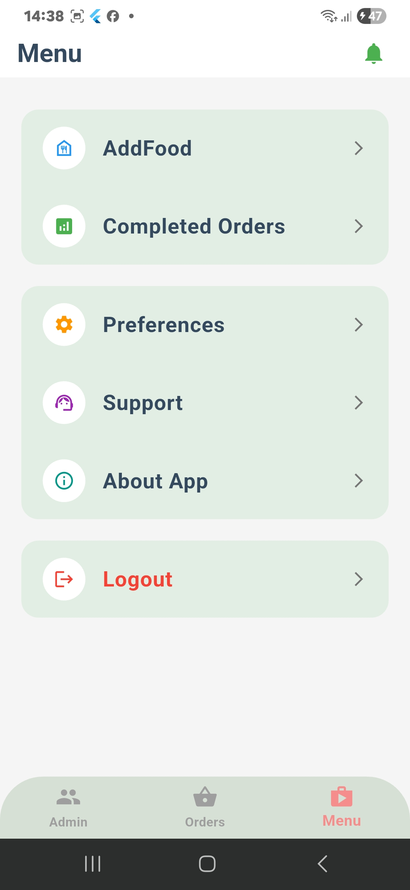
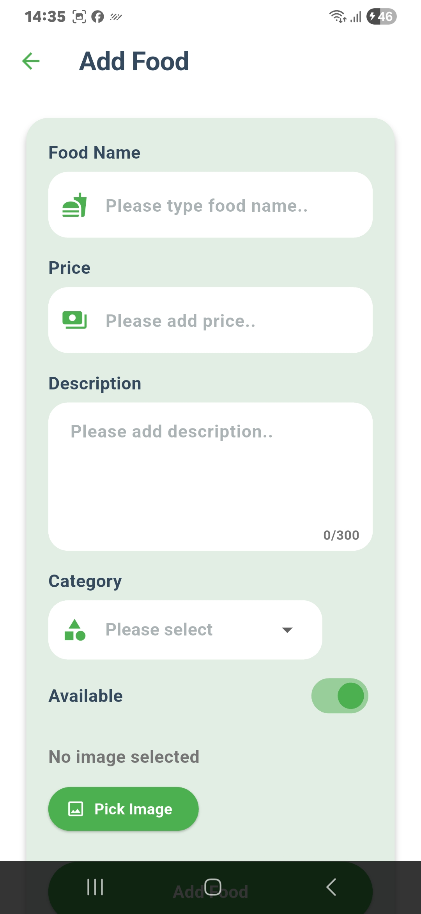
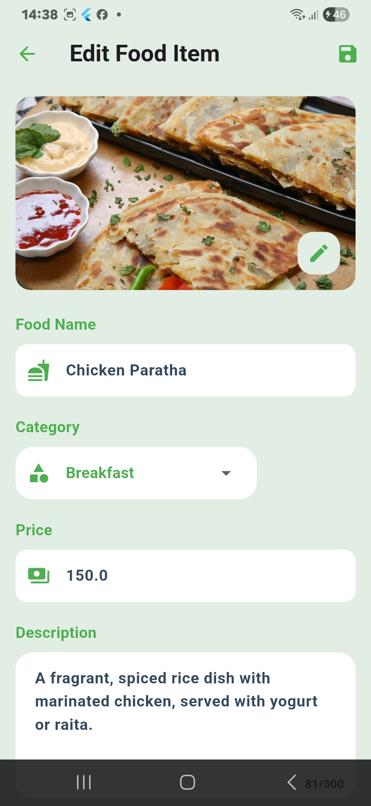
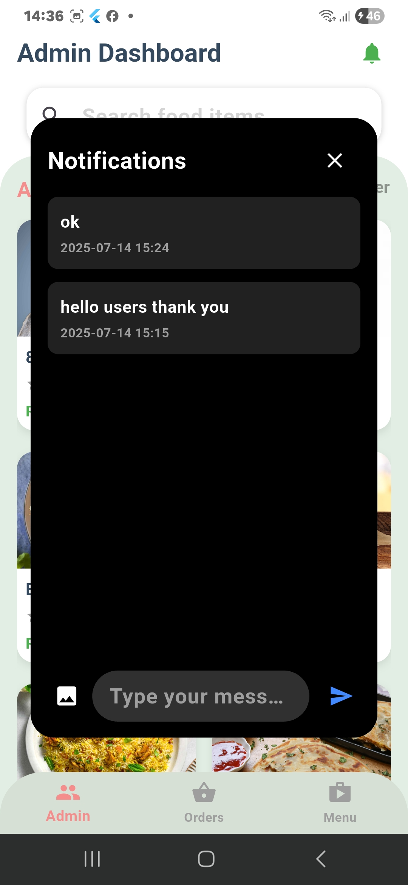
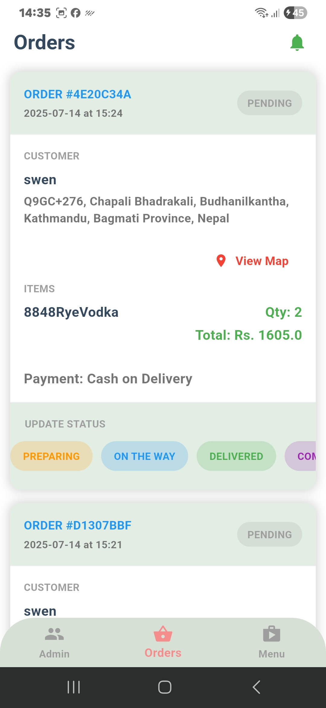
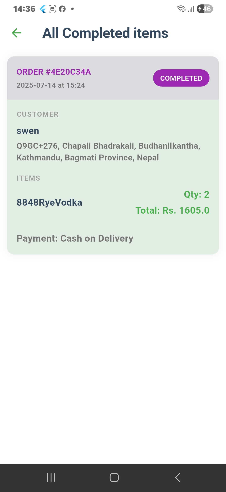
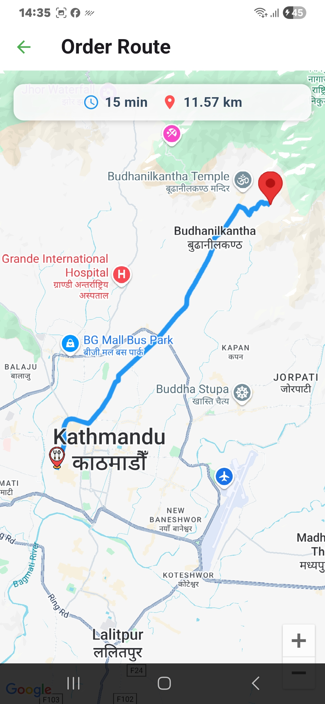

# 📝 Admin App

A simple and efficient **Restaurant Admin Application** built using **Flutter**, focused on managing menu items, orders, and restaurant operations with ease and clarity.

---

## ✨ Description

The **Restaurant Admin App** allows restaurant owners and staff to efficiently manage daily operations from a mobile device or tablet. With this app, administrators can:

- Add, update, or delete menu items  
- Track customer orders and order statuses  
- Manage food availability  
- Receive real-time order notifications  

Built with **Flutter** and **Supabase**, the app is optimized for performance, includes offline capabilities, and uses **Firebase Push Notifications** to alert staff about new or pending orders and offers.

---

## 🔑 Key Features

- 🧑‍🎨 **Clean and Intuitive UI**  
  A modern Flutter interface that enables smooth task management for menu and orders.

- 🗃️ **Persistent Storage with Supabase**  
  Stores food data, user orders, and manages secure admin authentication.

- 🔔 **Firebase Push Notifications**  
  Instantly notifies admins of incoming orders and promotional offers.

---

## 📸 App Screenshots

<h3 align="center">🏠 Login Page – Admin Dashboard – Setting Page</h3>

<p align="center">
  
  
  
</p>

---

<h3 align="center">➕ Add Item – Edit Item – Notification Panel</h3>

<p align="center">
  
  
  
</p>

---

<h3 align="center">📝 Orders Page – Completed Page – Users Location</h3>

<p align="center">
  
  
  
</p>

---

## 🚀 Quick Features Summary

- 📋 Add, edit, and delete menu items with images and pricing  
- 🧾 View and manage customer orders in real-time  
- 🔔 Push notifications for new orders and updates  
- 📦 Toggle item availability (e.g., mark items as "out of stock")  
- 🧠 Filter items by category (e.g., Beverages, Main Course, Desserts)  
- 🔍 View menus or orders by selected calendar date  
- 🪄 Smooth navigation and intuitive UX  
- 🎯 Fully responsive UI built with Flutter  

---

## 🛠️ Tech Stack

| Layer           | Technology                   |
|-----------------|------------------------------|
| 💻 Frontend     | Flutter (Dart)               |
| 🗃️ Database     | Supabase                     |
| 🔔 Notifications| Firebase Push Notifications  |
| 🔐 Auth         | Supabase Auth                |
| 🌐 API          | Google APIs (e.g., Location) |

---

## 🔧 Installation

> Follow these steps to run the app locally:

```bash
# 1. Clone the repository
git clone https://github.com/yourusername/restaurant-admin-app.git

# 2. Navigate to the project folder
cd restaurant-admin-app

# 3. Get the Flutter packages
flutter pub get

# 4. Run the app on your device/emulator
flutter run


## 📬 Contact

For feedback or questions, reach out via:

- 💼 LinkedIn: [Swen Shrestha](https://www.linkedin.com/in/swen-shrestha-a89041304/)

- 📧 Email: [shresthaswen80@gmail.com](mailto:shresthaswen80@gmail.com)


---

## ⭐️ Show Your Support

If you like this project, please ⭐️ it and share it with your friends!

---
gi
