# 🍽️ Client App – Restaurant Ordering System

A sleek and user-friendly **Restaurant Client Application** built using **Flutter**, enabling customers to browse the menu, place orders, and track their delivery in real-time — all from the palm of their hand.

---

## ✨ Description

The **Restaurant Client App** provides an elegant solution for customers to easily browse food menus, customize orders, and receive order status updates. Built with **Flutter** and powered by **Supabase** and **Firebase**, this app ensures fast performance, a smooth ordering experience, and real-time updates — making dining more convenient than ever.

---

## 🔑 Key Features

- 🍴 **Intuitive Menu Browsing**  
  Explore categorized food and beverage items with rich visuals and descriptions.

- 🛒 **Customizable Cart & Orders**  
  Add items to your cart, apply custom notes (e.g., “extra spicy”), and place orders seamlessly.

- 🔄 **Real-time Order Tracking**  
  Get updates on order status (e.g., Preparing, Out for Delivery, Delivered).

- 🧾 **Order History**  
  View previous orders and quickly reorder your favorites.

- 🔔 **Push Notifications**  
  Receive real-time notifications on order confirmations and delivery status.

---

## 📸 App Screenshots

<h3 align="center">🍔 Authentication Page</h3>

<p align="center">
  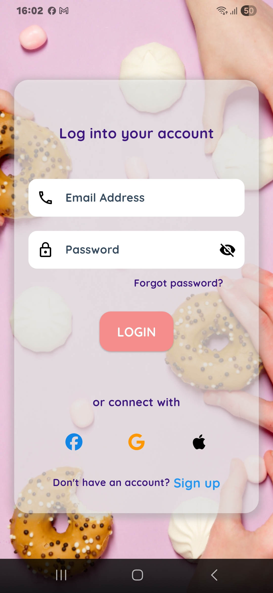
  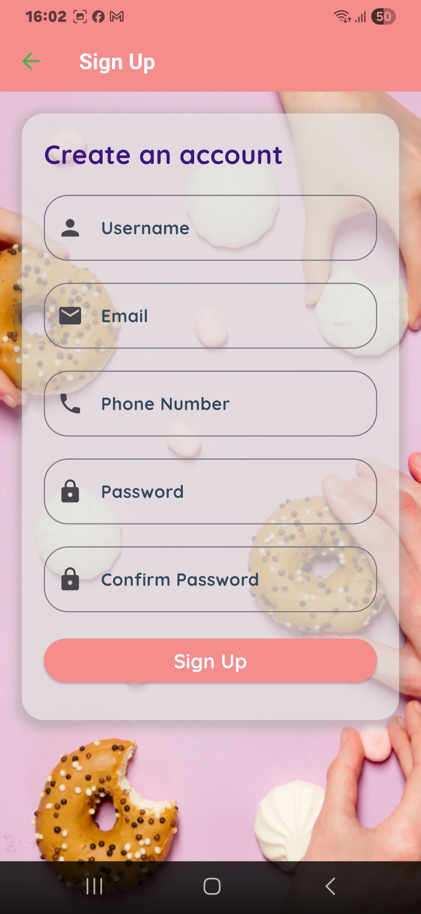
  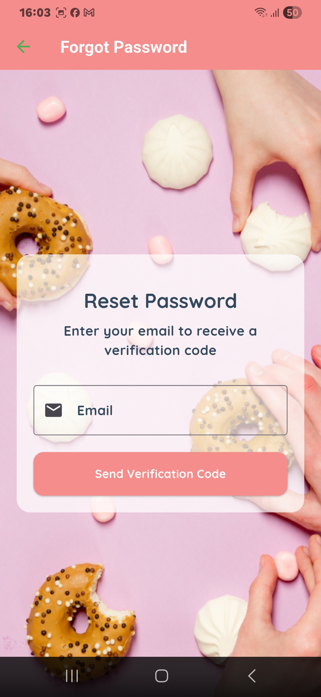
  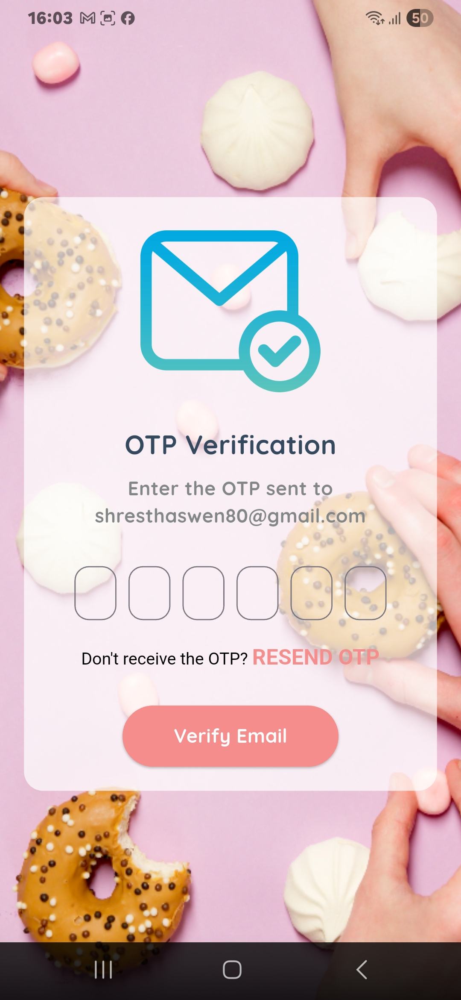
</p>

---

<h3 align="center">📦 Landing Page - Food List - Category Page - Search page</h3>

<p align="center">
  
  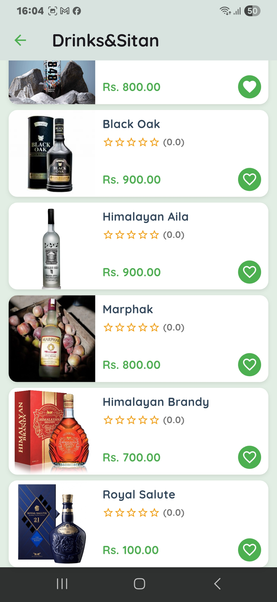
  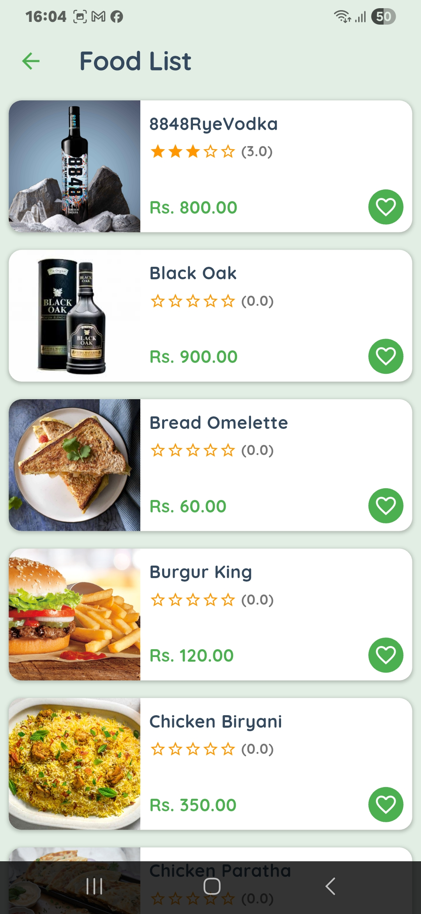
  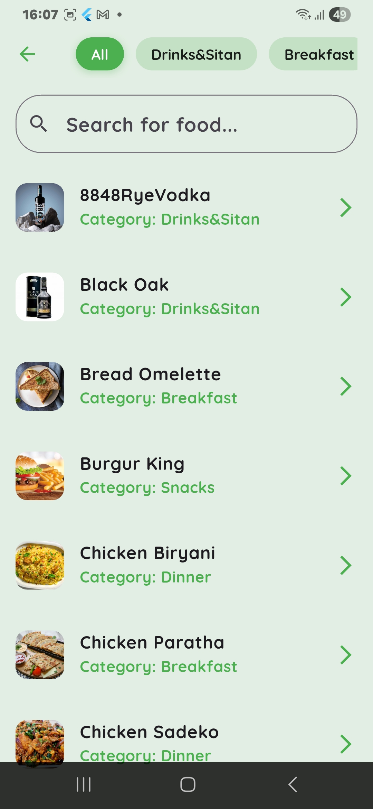
</p>

---

<h3 align="center">📦 About Page - Favourite Page - Cart Page - CheckOut page</h3>

<p align="center">
  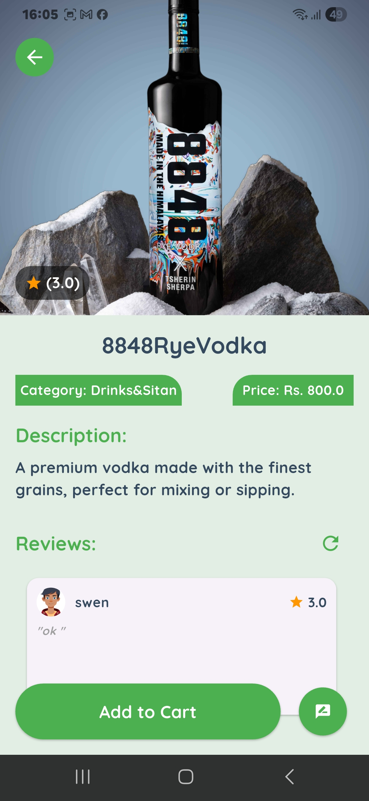
  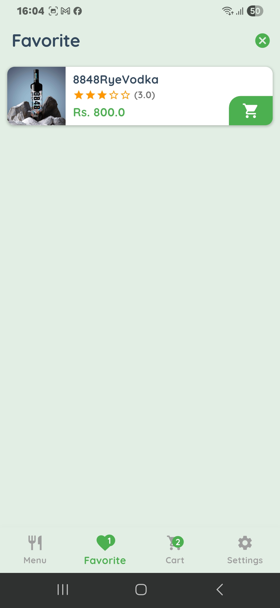
  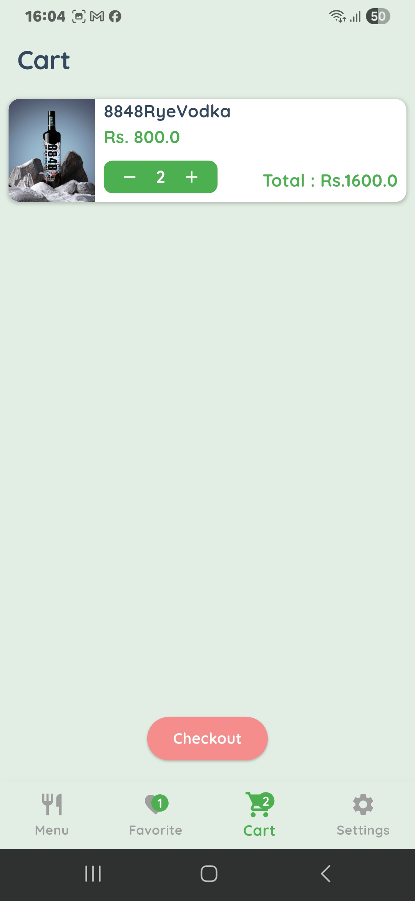
  
</p>

---

<h3 align="center">📦 User Location - Profile Page - Reviews Page - Order page</h3>

<p align="center">
  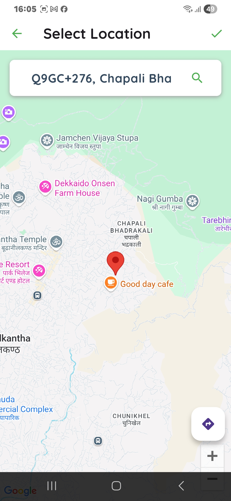
  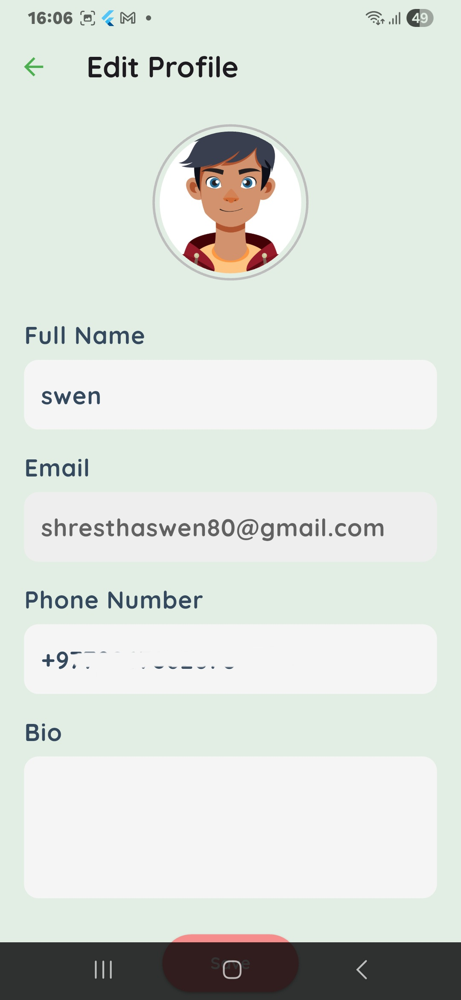
  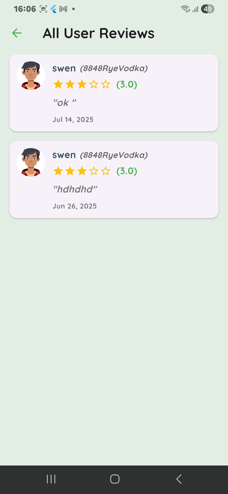
  
</p>

---


## 🚀 Quick Features Summary

- 🔍 Browse categorized food menus  
- 🛒 Add items to cart and checkout  
- 🔁 Track orders in real-time  
- 🧾 View past orders  
- 💸 Apply promo codes and discounts  
- 🔔 Firebase Push Notifications  
- 💬 Leave ratings and reviews  
- 🧭 GPS location for delivery tracking  
- 🎯 Smooth and responsive UI  

---

## 🛠️ Tech Stack

| Layer           | Technology                   |
|-----------------|------------------------------|
| 💻 Frontend     | Flutter (Dart)               |
| 🗃️ Database     | Supabase                     |
| 🔔 Notifications| Firebase Push Notifications  |
| 🔐 Auth         | Supabase Auth                |
| 🗺️ Location     | Google Maps / Geolocation API|

---

## 🔧 Installation

> Follow these steps to run the app locally:

```bash
# 1. Clone the repository
git clone https://github.com/yourusername/restaurant-client-app.git

# 2. Navigate to the project folder
cd restaurant-client-app

# 3. Get the Flutter packages
flutter pub get

# 4. Run the app on your device/emulator
flutter run
```
---
## 📬 Contact

For feedback or questions, reach out via:

- 💼 LinkedIn: [Swen Shrestha](https://www.linkedin.com/in/swen-shrestha-a89041304/)

- 📧 Email: [shresthaswen80@gmail.com](mailto:shresthaswen80@gmail.com)

## ⭐️ Show Your Support

If you like this project, please ⭐️ it and share it with your friends!

---
gi